# PETSc Agent Benchmark

An agentified evaluation framework for testing PETSc code generation agents using A2A (Agent-to-Agent) and MCP (Model Context Protocol) standards.

## Overview

This repository implements a multi-agent benchmark for evaluating code generation agents that produce PETSc (Portable, Extensible Toolkit for Scientific Computation) programs.
> [!IMPORTANT]
> 📖 See [MOTIVATION.md](MOTIVATION.md) for the motivation and design rationale behind this project.

Core building blocks:

- **A2A Protocol**: standardized agent-to-agent communication over HTTP.
- **MCP Protocol**: tool access for compilation and execution.
- **Evaluation pipeline**: gates + metrics + LLM-based quality evaluators, aggregated into a composite score and tier.

High-level flow:

1. The **Green Agent** loads benchmark problems from `data/*.json`.
2. For each problem, it asks the **Purple Agent** to generate PETSc code.
3. It compiles and runs the returned code via MCP tools.
4. It evaluates results and writes reports to `output/`.

> Note: Running the benchmark can consume significant LLM tokens depending on the model and number of problems.

## Architecture

```mermaid
flowchart LR
    subgraph Input
        P["📋 Problem<br/>JSON (data/*.json)"]
    end

    subgraph Agents
        Purple["🟣 Purple Agent<br/>Code Generator<br/>Returns code files + metadata:<br/>`main_file`, `dependencies`, `cli_args`"]
        Green["🟢 Green Agent<br/>Evaluator<br/>Packages files & forwards to MCP"]
    end

    subgraph Execution
        MCP["⚙️ MCP Server<br/>Compile & Run<br/>(updates Makefile/build recipe)"]
    end

    subgraph Artifacts
        A["🧾 Artifacts<br/>compile stdout/stderr, run stdout/stderr, exit code"]
    end

    subgraph Evaluation
        E["📊 Evaluate<br/>Gates → Metrics → Quality"]
    end

    subgraph Output
        R["📁 Report<br/>Score + Tier"]
    end

    P --> Green
    Green -->|"A2A: request code"| Purple
    Purple -->|"PETSc Code + metadata"| Green
    Green -->|"Package files; specify `main_file` & deps"| MCP
    MCP -->|"Compile/Run → Artifacts"| A
    A -->|"Results & logs"| Green
    Green --> E
    E --> R
```



The system consists of three components:

1. **Green Agent** (assessment manager)
   - Loads benchmark problems from `data/*.json`
   - Sends each problem description to the Purple Agent via A2A
   - Compiles and runs returned code via MCP tools
   - Scores results (gates + metrics + quality) and aggregates into a composite score + tier
   - Writes reports to `output/`

2. **Purple Agent** (target under test)
   - Receives a problem description via A2A
   - Uses an LLM to generate PETSc code
   - Returns:
     - a status text that includes `cli_args`
     - one or more code files

3. **MCP Server** (tool provider)
   - Provides compilation and execution tools for PETSc code (used by the Green Agent)

### Why PETSc?

PETSc is an ideal benchmark for evaluating LLM capabilities in scientific computing because it demands:

- **Domain expertise**: Numerical methods, PDEs, linear algebra, and parallel computing
- **Large API surface**: 1000+ functions across solvers (TS, SNES, KSP), data structures (Vec, Mat, DM), and optimizers (TAO)
- **Correctness and performance**: Solutions must be mathematically accurate *and* computationally efficient
- **Parallel programming**: MPI, domain decomposition, GPU acceleration (CUDA/HIP)

Unlike toy benchmarks, PETSc code generation tests whether LLMs can produce **scientifically valid, performant, and maintainable** solutions for real-world HPC applications. See [PETSc applications](https://petsc.org/main/miscellaneous/applications_publications/) for examples spanning climate modeling, CFD, astrophysics, and more.


## Evaluation System

At a high level, evaluation is organized into:

- **Gates**: binary pass/fail checks (e.g., compilation/execution/API usage)
- **Metrics**: quantitative measurements (e.g., numerical accuracy, execution time)
- **Quality**: LLM-based qualitative assessment (e.g., code style, algorithm choice, PETSc best practices)

> [!IMPORTANT]
> For full details on the evaluation design, scoring, and components, see [EVALUATION_SYSTEM_SUMMARY.md](EVALUATION_SYSTEM_SUMMARY.md).

## Benchmark Problems

Benchmark problems are defined as JSON files under `data/`. The Green Agent loads **all** JSON files in that directory. 

Each problem file is expected to contain (at minimum):

- `problem_name`
- `problem_id`
- `problem_description`

Current suite (see `data/` for full definitions):

- Robertson ODE
- 1D Advection
- Rosenbrock optimization
- Darcy flow
- 2D Navier–Stokes
- Vec/MPI tests

`gpu_data` contains problems that run on GPUs. Since our Github runners do not support GPU at the moment, they are not included in the default setting, but can be activated manually. 

### Evaluation Criteria

Each problem is evaluated across multiple dimensions (see `config/green_agent_config.yaml` for weights):

- Correctness
- Performance
- Code quality
- Algorithm choice
- PETSc best practices
- Semantic correctness

## Output

### Files written to disk

The Green Agent writes a single file to `output/`:

- `output/benchmark_summary.json`: overall summary + per-problem results

### Task artifacts

The Green Agent also emits A2A task artifacts (via `TaskUpdater.add_artifact`). Depending on your runner/integration, these may be downloadable from logs/UI but are not written to `output/` by default:

### Tier System

Codes are assigned to tiers based on composite scores:

- 🥇 **GOLD** (≥85): Excellent code quality and correctness
- 🥈 **SILVER** (≥70): Good code with minor issues
- 🥉 **BRONZE** (≥50): Functional but needs improvement
- ❌ **FAIL** (<50 or gate failure): Significant issues

## Project Structure

```
├── data/                           # Benchmark problems (JSON files)
├── config/                         # Configuration files
│   ├── green_agent_config.yaml     # Green agent evaluation + scoring + LLM settings
│   └── purple_agent_config.yaml    # Purple agent LLM settings
├── src/
│   ├── client_cli.py               # Sends “start benchmark” task to the Green Agent
│   ├── launcher.py                 # Spawns Green/Purple/MCP locally (end-to-end)
│   ├── green_agent/                # Assessment manager agent
│   ├── purple_agent/               # Target agent under test
│   ├── evaluators/                 # Gates / metrics / quality evaluators
│   ├── metrics/                    # Score aggregation + tiering
│   └── util/                       # A2A helpers + LLM client
├── main.py                         # CLI entry point (green/purple/launch)
├── pyproject.toml                  # Python project configuration
├── output/                         # Generated reports and results
└── purple_agent_cache/             # Cached purple-agent responses (optional)
```

## Installation

### Prerequisites

1. **PETSc Installation**: Install PETSc from [https://petsc.org/](https://petsc.org/) for local compilation/execution.
2. **Python 3.12+**: Required (see `pyproject.toml`).
3. **uv**: Python package manager used by this repo: https://github.com/astral-sh/uv

### Setup

1. Install dependencies using `uv`:

```bash
uv sync
```

2. Create a `.env` file in the root directory with the following variables:

```bash
# LLM API Keys
GEMINI_API_KEY="<your_gemini_key>"
OPENAI_API_KEY="<your_openai_key>"

# PETSc Configuration (required for compilation/execution)
PETSC_DIR="<path_to_petsc_installation>"
PETSC_ARCH="<petsc_architecture>"  # e.g., arch-darwin-c-debug
```

## Usage

### Quick Start

For local testing, launch the complete evaluation workflow:

```bash
uv run main.py launch
```

This command will:
1. Start the Green Agent (assessment manager)
2. Start the Purple Agent (code generator)
3. Start the MCP server (compilation/execution tools)
4. Run all benchmark problems
5. Generate evaluation reports in `output/`

### Deploying Individual Components

You can run the components separately (useful when deploying services on different machines or restarting a single component during development).

```bash
# Start only the Green Agent
uv run src/green_agent/server.py

# Start only the Purple Agent
uv run src/purple_agent/petsc_agent.py
```

For MCP server deployment, refer to https://gitlab.com/petsc/petsc_mcp_servers

Once the Green Agent, Purple Agent, and MCP server are running, trigger a benchmark run by sending the task message to the Green Agent:

```bash
uv run src/client_cli.py --green-url <GREEN_URL> --purple-url <PURPLE_URL> --mcp-server-url <MCP_URL>
```


### Configuration

The system uses separate configuration files for each agent:

- `config/green_agent_config.yaml` - Green agent LLM model and evaluation settings
- `config/purple_agent_config.yaml` - Purple agent LLM model settings

Example `config/green_agent_config.yaml`:

```yaml
evaluation:
  enable_gates: true          # Enable binary pass/fail checks
  enable_metrics: true        # Enable quantitative measurements
  enable_quality: true        # Enable quality assessments
  parallel_evaluation: true   # Run evaluators in parallel
  
  llm:
    model: "openai/gpt52"            # LLM for quality evaluation
    api_base_url: "https://apps-dev.inside.anl.gov/argoapi/v1"  # Optional API base URL (e.g., Argo/AskSage)
    temperature: 0                    # Set to 0 only for reproducibility
    max_concurrent_calls: 3           # Rate limiting for LLM calls

scoring:
  weights:
    correctness: 0.35     # Weight for correctness score
    performance: 0.15     # Weight for performance metrics
    code_quality: 0.15    # Weight for code quality
    algorithm: 0.15       # Weight for algorithm choice
    petsc: 0.10          # Weight for PETSc best practices
    semantic: 0.10       # Weight for semantic correctness
  
  tiers:
    gold: 85      # Minimum score for GOLD tier
    silver: 70    # Minimum score for SILVER tier
    bronze: 50    # Minimum score for BRONZE tier
```

Example `config/purple_agent_config.yaml`:

```yaml
llm:
  model: "openai/claudeopus45"     # LLM for code generation
  api_base_url: "https://apps-dev.inside.anl.gov/argoapi/v1"  # Optional API base URL (e.g., Argo/AskSage)
  temperature: 0                    # Set to 0 only for reproducibility
```

**Note**:
- Use a LiteLLM-style name, e.g. `<provider_name>/<model_name>`. For models provided with an OpenAI-compatible endpoint, use `openai` as the provider name.
- Leave `api_base_url` `null` to use each provider’s default (e.g. `https://api.openai.com/v1`). Set this to use a custom or proxy endpoint (e.g. `https://apps-dev.inside.anl.gov/argoapi/v1` for Argo). For OpenAI-compatible APIs the URL should end with `/v1`; the client will use the appropriate LiteLLM provider prefix.
- The system auto-detects AskSage endpoints when `api_base_url` starts with `https://api.asksage.anl.gov` and configures SSL and API keys accordingly.


## Development

### Adding custom evaluators

Evaluators live under `src/evaluators/` and are wired into the pipeline in `src/evaluators/pipeline.py`.

To add a new evaluator:

1. Create a class inheriting from `src.evaluators.base.Evaluator`
2. Implement `name`, `evaluator_type`, and `evaluate(...)`
3. Add the evaluator to the pipeline

Example:

```python
from src.evaluators.base import Evaluator, EvaluatorType, EvaluationResult

class MyCustomEvaluator(Evaluator):
    @property
    def name(self) -> str:
        return "my_custom_check"
    
    @property
    def evaluator_type(self) -> EvaluatorType:
        return EvaluatorType.QUALITY

    async def evaluate(self, code: str, problem: dict, execution_result: dict | None = None) -> EvaluationResult:
        return EvaluationResult(
            evaluator_name=self.name,
            evaluator_type=self.evaluator_type,
            quality_score=0.8,
            feedback="Custom evaluation passed",
            evaluation_method="deterministic",
            confidence=1.0,
        )
```

### Caching

The Green Agent can cache Purple Agent responses (pickled per problem) to speed up development iteration. Cached responses are stored in `purple_agent_cache/`.

## Troubleshooting

### Common Issues

1. **Wrong Python version**: This repo requires Python **3.12+** (see `pyproject.toml`).
2. **PETSc not found**: Ensure `PETSC_DIR` and `PETSC_ARCH` are set correctly in `.env`.
3. **LLM API/proxy errors**:
   - Verify API keys are valid and have sufficient quota.
   - If using an OpenAI-compatible proxy (Argo/AskSage), ensure `api_base_url` is set correctly in the relevant config.
   - For AskSage endpoints, ensure `ASKSAGE_API_KEY` and `ASKSAGE_SSL_CERT_FILE` are set.
4. **Agent connectivity / timeouts**:
   - Confirm the Green and Purple URLs/ports match your deployment.
   - If agents are slow to start, you may need to increase timeouts in `src/util/a2a_comm.py`.
5. **Port conflicts**: Modify ports in `src/launcher.py` if defaults are in use (Green `9001`, Purple `9002`, MCP `8080`).
6. **Missing output files**: Only `output/benchmark_summary.json` is written to disk by default; other reports are emitted as task artifacts.
